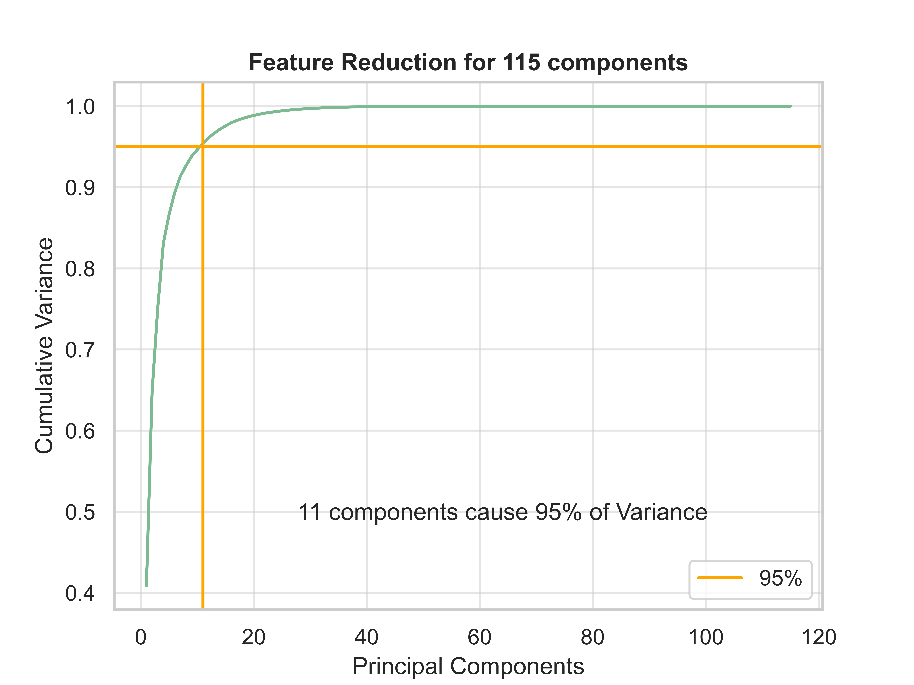
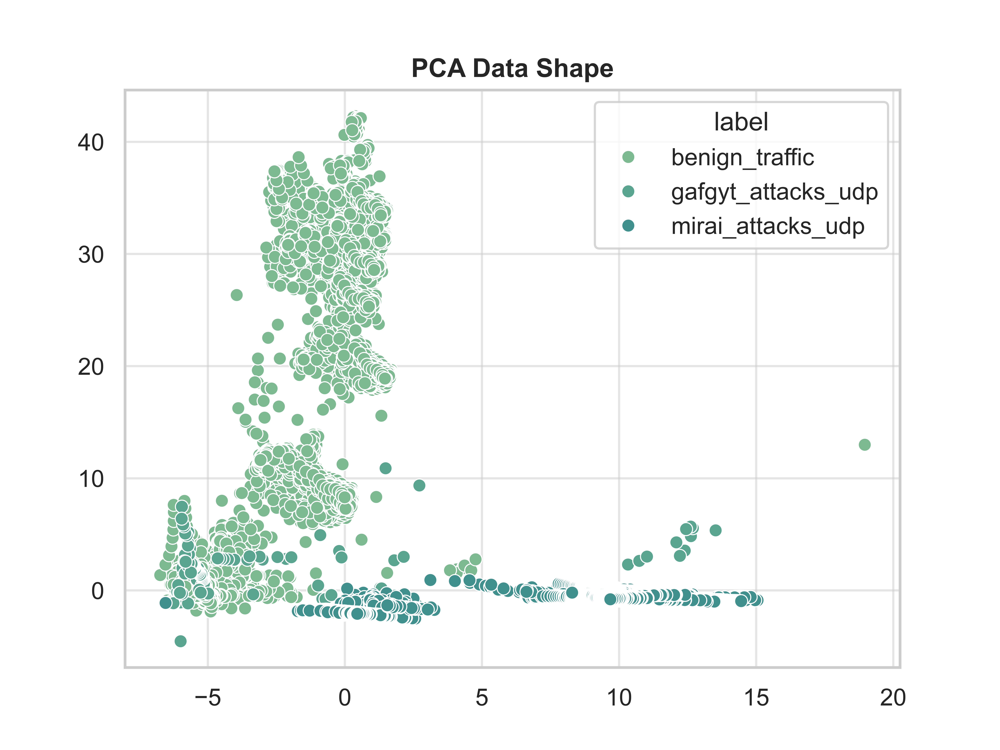

# Exploratory Data Analysis

| label              |       count |
| :----------------- | ----------: |
| benign_traffic     |  62,154.000 |
| gafgyt_attacks_udp | 104,011.000 |
| mirai_attacks_udp  | 156,248.000 |

| Dataset:      |                                  Raw Data: |
| :------------ | -----------------------------------------: |
| Feature Count |                                    120.000 |
| Entries       |                                322,413.000 |
| Duplicates    |                                      12572 |
| Null Values   |                                          0 |
| Data Types    | float32(74), float64(44), int64(1), str(1) |
| Memory Usage  |                                   206.6 MB |

## Feature Skewing

## Correlation

New Shape: (322413, 34)

## Data-Shape

## Histogram by window-size

| Section             |       Duration |
| :------------------ | -------------: |
| total               | 0:01:28.081207 |
| setup               | 0:00:03.008004 |
| correlation figures | 0:00:22.221206 |
| Screeplot           | 0:00:01.946271 |
| raw scatterplot     | 0:00:16.552006 |
| histograms          | 0:00:38.751462 |
