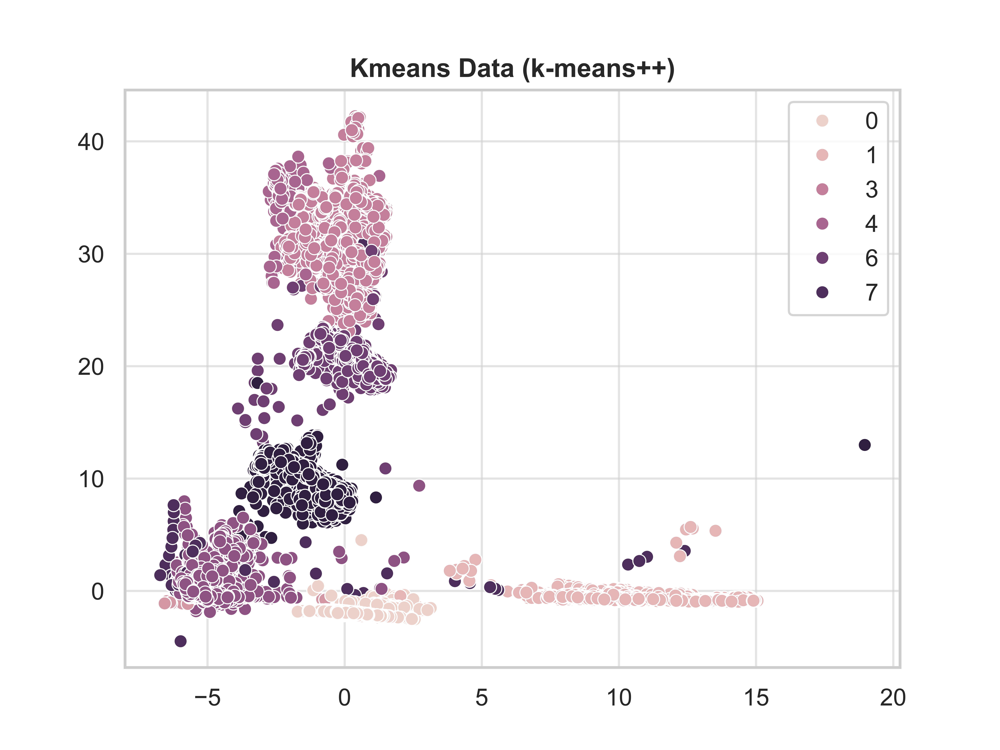
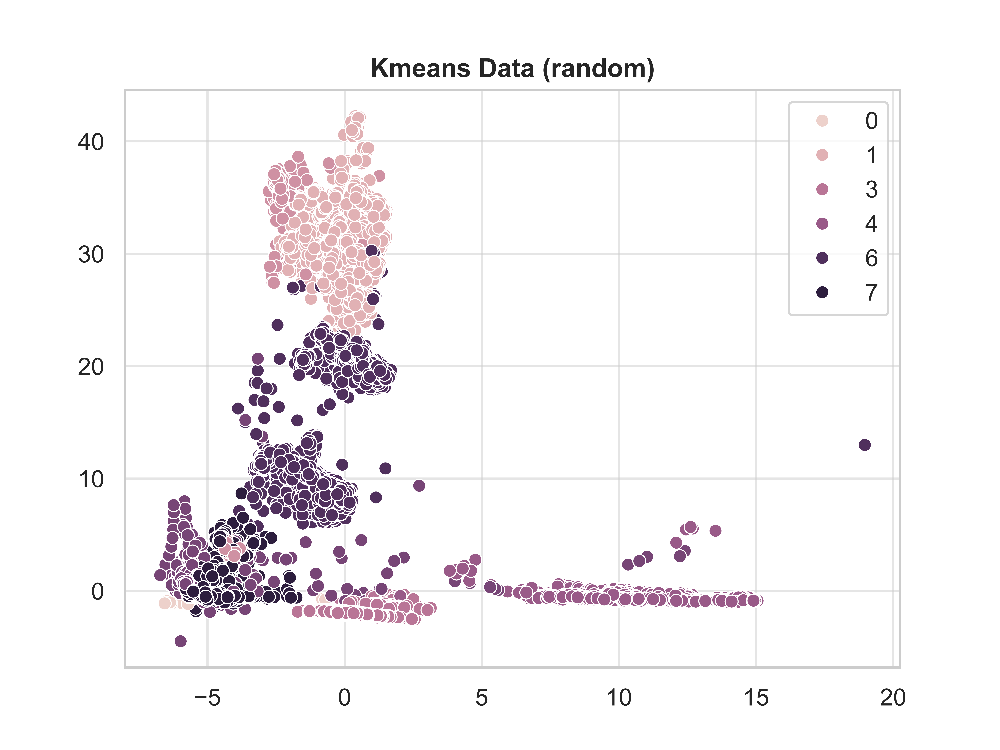

# Training - Unsupervised

> [!INFO] Train Test Split:
> Random state: 19980616
> Test Size: 0.2
> Feature Flags:
>
> - Stratified: True
> - Scaled: True
> - String-Label: False
>   Test columns:
> - label
> - is_attack
> - type-benign_traffic
> - type-gafgyt_attacks_udp
> - type-mirai_attacks_udp

## KMeans

Arguably the most simple clustering method, given a new point poll the
nearest K points, majority wins. To refine the best K, we iterate over
the possible values and plot the output.

Best kmeans for `k-means++` is 9

Best kmeans for `random` is 8

## OPTICS and DBSCAN

Both of these models are functionally interesting with some issues for training
situations. Sci-kit's `OPTICS` is less actively memory intensive, but is prone
to hanging quietly as it shuffles the memory consumption behind the scenes.
`OPTICS` also works similarly to `DBSCAN`, a model that does not share the same
approach to memory-safety. `DBSCAN` will consume the available ram and cause
system-crashes. To reduce the impact of these issues, both models are trained
on 5150 random sub-samples

### DBSCAN - Distance Based Scanning

|     | Euclidean Distance | Minimum Samples | Clusters identified |   Noise | Silhouette | Adjusted Random Index | Normalised Mutual Information |
| --: | -----------------: | --------------: | ------------------: | ------: | ---------: | --------------------: | ----------------------------: |
|   0 |                0.5 |               5 |                  34 | 42.4466 |  0.0439008 |              0.528762 |                      0.590772 |
|   1 |                0.5 |              10 |                  23 | 49.1845 |  0.0249156 |              0.571639 |                      0.614506 |
|   2 |                0.5 |              15 |                  10 | 54.9515 |  0.0597094 |              0.608074 |                      0.659696 |
|   3 |                0.5 |              20 |                   6 | 57.4369 |   0.244311 |               0.60623 |                      0.673595 |
|   4 |                  1 |               5 |                  32 | 13.8835 |   0.330005 |              0.565669 |                      0.642867 |
|   5 |                  1 |              10 |                  13 | 20.0388 |   0.410832 |              0.544151 |                      0.650499 |
|   6 |                  1 |              15 |                  10 | 23.9612 |   0.483605 |              0.525507 |                      0.644739 |
|   7 |                  1 |              20 |                   7 | 27.6311 |    0.45164 |              0.513278 |                      0.644818 |
|   8 |                1.5 |               5 |                  16 |  6.8932 |   0.576375 |              0.659771 |                      0.738915 |
|   9 |                1.5 |              10 |                  10 | 8.93204 |   0.649416 |               0.65242 |                       0.73848 |
|  10 |                1.5 |              15 |                   5 | 11.8447 |   0.633519 |              0.637223 |                      0.735855 |
|  11 |                1.5 |              20 |                   5 | 13.1068 |   0.619542 |              0.622816 |                       0.72422 |
|  12 |                  2 |               5 |                  17 | 3.94175 |   0.674751 |              0.684404 |                      0.764478 |
|  13 |                  2 |              10 |                   7 | 6.21359 |   0.666701 |               0.68448 |                      0.780579 |
|  14 |                  2 |              15 |                   6 | 7.65049 |   0.672492 |              0.678536 |                      0.775782 |
|  15 |                  2 |              20 |                   5 | 8.75728 |   0.665985 |              0.673163 |                      0.771735 |
|  16 |                2.5 |               5 |                  13 | 3.32039 |   0.650601 |               0.69372 |                      0.783101 |
|  17 |                2.5 |              10 |                   8 | 4.48544 |   0.701435 |              0.694613 |                      0.791728 |
|  18 |                2.5 |              15 |                   5 |  5.5534 |   0.701626 |              0.694232 |                      0.798179 |
|  19 |                2.5 |              20 |                   4 | 6.29126 |    0.70607 |              0.693187 |                      0.799999 |
|  20 |                  3 |               5 |                  11 | 2.66019 |   0.652244 |              0.697441 |                      0.788486 |
|  21 |                  3 |              10 |                   9 | 3.53398 |   0.707333 |              0.696664 |                      0.790454 |
|  22 |                  3 |              15 |                   5 | 4.87379 |   0.705519 |              0.697649 |                      0.801919 |
|  23 |                  3 |              20 |                   5 | 5.00971 |    0.70411 |              0.697536 |                      0.802263 |
|  24 |                3.5 |               5 |                  13 | 1.92233 |   0.669279 |              0.697428 |                      0.785717 |
|  25 |                3.5 |              10 |                   9 | 2.71845 |   0.715916 |              0.697757 |                      0.789408 |
|  26 |                3.5 |              15 |                   8 | 3.18447 |   0.711648 |              0.697868 |                      0.792262 |
|  27 |                3.5 |              20 |                   5 |  4.7767 |   0.705755 |              0.698429 |                      0.803013 |

### OPTICS - Ordering Points To Identify the Clustering Structure

OPTICS is functionally similar to DBSCAN.

|     | Euclidean Distance | Minimum Samples | Clusters identified |   Noise | Silhouette | Adjusted Random Index | Normalised Mutual Information |
| --: | -----------------: | --------------: | ------------------: | ------: | ---------: | --------------------: | ----------------------------: |
|   0 |                0.5 |               5 |                 298 | 60.7379 |  -0.595942 |              0.166211 |                      0.251107 |
|   1 |                0.5 |              10 |                 118 | 68.5631 |  -0.603793 |              0.266161 |                      0.288529 |
|   2 |                0.5 |              15 |                  75 | 22.1748 |    0.12977 |              0.386028 |                      0.480801 |
|   3 |                0.5 |              20 |                  51 | 46.4854 |  -0.201028 |              0.184269 |                       0.34317 |
|   4 |                  1 |               5 |                 298 | 60.7379 |  -0.595942 |              0.166211 |                      0.251107 |
|   5 |                  1 |              10 |                 118 | 68.5631 |  -0.603793 |              0.266161 |                      0.288529 |
|   6 |                  1 |              15 |                  75 | 22.1748 |    0.12977 |              0.386028 |                      0.480801 |
|   7 |                  1 |              20 |                  51 | 46.4854 |  -0.201028 |              0.184269 |                       0.34317 |
|   8 |                1.5 |               5 |                 298 | 60.7379 |  -0.595942 |              0.166211 |                      0.251107 |
|   9 |                1.5 |              10 |                 118 | 68.5631 |  -0.603793 |              0.266161 |                      0.288529 |
|  10 |                1.5 |              15 |                  75 | 22.1748 |    0.12977 |              0.386028 |                      0.480801 |
|  11 |                1.5 |              20 |                  51 | 46.4854 |  -0.201028 |              0.184269 |                       0.34317 |
|  12 |                  2 |               5 |                 298 | 60.7379 |  -0.595942 |              0.166211 |                      0.251107 |
|  13 |                  2 |              10 |                 118 | 68.5631 |  -0.603793 |              0.266161 |                      0.288529 |
|  14 |                  2 |              15 |                  75 | 22.1748 |    0.12977 |              0.386028 |                      0.480801 |
|  15 |                  2 |              20 |                  51 | 46.4854 |  -0.201028 |              0.184269 |                       0.34317 |
|  16 |                2.5 |               5 |                 298 | 60.7379 |  -0.595942 |              0.166211 |                      0.251107 |
|  17 |                2.5 |              10 |                 118 | 68.5631 |  -0.603793 |              0.266161 |                      0.288529 |
|  18 |                2.5 |              15 |                  75 | 22.1748 |    0.12977 |              0.386028 |                      0.480801 |
|  19 |                2.5 |              20 |                  51 | 46.4854 |  -0.201028 |              0.184269 |                       0.34317 |
|  20 |                  3 |               5 |                 298 | 60.7379 |  -0.595942 |              0.166211 |                      0.251107 |
|  21 |                  3 |              10 |                 118 | 68.5631 |  -0.603793 |              0.266161 |                      0.288529 |
|  22 |                  3 |              15 |                  75 | 22.1748 |    0.12977 |              0.386028 |                      0.480801 |
|  23 |                  3 |              20 |                  51 | 46.4854 |  -0.201028 |              0.184269 |                       0.34317 |
|  24 |                3.5 |               5 |                 298 | 60.7379 |  -0.595942 |              0.166211 |                      0.251107 |
|  25 |                3.5 |              10 |                 118 | 68.5631 |  -0.603793 |              0.266161 |                      0.288529 |
|  26 |                3.5 |              15 |                  75 | 22.1748 |    0.12977 |              0.386028 |                      0.480801 |
|  27 |                3.5 |              20 |                  51 | 46.4854 |  -0.201028 |              0.184269 |                       0.34317 |

## AgglomerativeClustering

Recursively merge clusters by linkage distance.

|          | Clusters identified | Noise | Silhouette | Adjusted Random Index | Normalised Mutual Information |
| :------- | ------------------: | ----: | ---------: | --------------------: | ----------------------------: |
| ward     |                  14 |     0 |   0.629957 |              0.630289 |                      0.747925 |
| complete |                  14 |     0 |   0.573737 |              0.774497 |                      0.757186 |
| average  |                  14 |     0 |   0.505017 |             0.0402316 |                     0.0881587 |

## Timings for Training

| Section                 |       Duration |
| :---------------------- | -------------: |
| total                   | 0:04:24.976672 |
| setup                   | 0:00:04.661222 |
| train test split        | 0:00:01.606383 |
| sub-sample              | 0:00:00.008413 |
| k-means                 | 0:01:21.725838 |
| k:2 I:k-means++         | 0:00:00.600906 |
| k:3 I:k-means++         | 0:00:00.538695 |
| k:4 I:k-means++         | 0:00:00.523056 |
| k:5 I:k-means++         | 0:00:00.537268 |
| k:6 I:k-means++         | 0:00:00.631377 |
| k:7 I:k-means++         | 0:00:00.661936 |
| k:8 I:k-means++         | 0:00:00.598921 |
| k:9 I:k-means++         | 0:00:00.603470 |
| k:10 I:k-means++        | 0:00:00.667668 |
| k:11 I:k-means++        | 0:00:00.745129 |
| k:12 I:k-means++        | 0:00:00.738880 |
| k:13 I:k-means++        | 0:00:00.734000 |
| k:14 I:k-means++        | 0:00:00.750964 |
| k:15 I:k-means++        | 0:00:00.769207 |
| k:2 I:random            | 0:00:00.921024 |
| k:3 I:random            | 0:00:00.960278 |
| k:4 I:random            | 0:00:01.092744 |
| k:5 I:random            | 0:00:01.312597 |
| k:6 I:random            | 0:00:01.521032 |
| k:7 I:random            | 0:00:02.063840 |
| k:8 I:random            | 0:00:01.864441 |
| k:9 I:random            | 0:00:02.607384 |
| k:10 I:random           | 0:00:02.461667 |
| k:11 I:random           | 0:00:02.379921 |
| k:12 I:random           | 0:00:03.192008 |
| k:13 I:random           | 0:00:03.017548 |
| k:14 I:random           | 0:00:03.198384 |
| k:15 I:random           | 0:00:03.900816 |
| DBSCAN                  | 0:00:08.196253 |
| DBS-E:0.5/MS:5          | 0:00:00.306683 |
| DBS-E:0.5/MS:10         | 0:00:00.321781 |
| DBS-E:0.5/MS:15         | 0:00:00.305258 |
| DBS-E:0.5/MS:20         | 0:00:00.300270 |
| DBS-E:1.0/MS:5          | 0:00:00.282208 |
| DBS-E:1.0/MS:10         | 0:00:00.289355 |
| DBS-E:1.0/MS:15         | 0:00:00.281263 |
| DBS-E:1.0/MS:20         | 0:00:00.290807 |
| DBS-E:1.5/MS:5          | 0:00:00.286138 |
| DBS-E:1.5/MS:10         | 0:00:00.286327 |
| DBS-E:1.5/MS:15         | 0:00:00.287174 |
| DBS-E:1.5/MS:20         | 0:00:00.286571 |
| DBS-E:2.0/MS:5          | 0:00:00.286680 |
| DBS-E:2.0/MS:10         | 0:00:00.290530 |
| DBS-E:2.0/MS:15         | 0:00:00.289501 |
| DBS-E:2.0/MS:20         | 0:00:00.286186 |
| DBS-E:2.5/MS:5          | 0:00:00.292661 |
| DBS-E:2.5/MS:10         | 0:00:00.290330 |
| DBS-E:2.5/MS:15         | 0:00:00.290653 |
| DBS-E:2.5/MS:20         | 0:00:00.292011 |
| DBS-E:3.0/MS:5          | 0:00:00.295887 |
| DBS-E:3.0/MS:10         | 0:00:00.291849 |
| DBS-E:3.0/MS:15         | 0:00:00.294911 |
| DBS-E:3.0/MS:20         | 0:00:00.291503 |
| DBS-E:3.5/MS:5          | 0:00:00.293707 |
| DBS-E:3.5/MS:10         | 0:00:00.297784 |
| DBS-E:3.5/MS:15         | 0:00:00.292483 |
| DBS-E:3.5/MS:20         | 0:00:00.290690 |
| OPTICS                  | 0:02:05.307218 |
| OPT-E:0.5/MS:5          | 0:00:04.531478 |
| OPT-E:0.5/MS:10         | 0:00:04.567198 |
| OPT-E:0.5/MS:15         | 0:00:04.511004 |
| OPT-E:0.5/MS:20         | 0:00:04.558259 |
| OPT-E:1.0/MS:5          | 0:00:04.622053 |
| OPT-E:1.0/MS:10         | 0:00:04.501021 |
| OPT-E:1.0/MS:15         | 0:00:04.507139 |
| OPT-E:1.0/MS:20         | 0:00:04.531076 |
| OPT-E:1.5/MS:5          | 0:00:04.537565 |
| OPT-E:1.5/MS:10         | 0:00:04.471736 |
| OPT-E:1.5/MS:15         | 0:00:04.423009 |
| OPT-E:1.5/MS:20         | 0:00:04.467757 |
| OPT-E:2.0/MS:5          | 0:00:04.458283 |
| OPT-E:2.0/MS:10         | 0:00:04.390497 |
| OPT-E:2.0/MS:15         | 0:00:04.448013 |
| OPT-E:2.0/MS:20         | 0:00:04.462041 |
| OPT-E:2.5/MS:5          | 0:00:04.465801 |
| OPT-E:2.5/MS:10         | 0:00:04.351306 |
| OPT-E:2.5/MS:15         | 0:00:04.372769 |
| OPT-E:2.5/MS:20         | 0:00:04.470821 |
| OPT-E:3.0/MS:5          | 0:00:04.523979 |
| OPT-E:3.0/MS:10         | 0:00:04.389568 |
| OPT-E:3.0/MS:15         | 0:00:04.371348 |
| OPT-E:3.0/MS:20         | 0:00:04.450331 |
| OPT-E:3.5/MS:5          | 0:00:04.457572 |
| OPT-E:3.5/MS:10         | 0:00:04.457083 |
| OPT-E:3.5/MS:15         | 0:00:04.476438 |
| OPT-E:3.5/MS:20         | 0:00:04.529857 |
| AgglomerativeClustering | 0:00:43.996083 |
| n:2/ward                | 0:00:01.019666 |
| n:3/ward                | 0:00:01.008188 |
| n:4/ward                | 0:00:00.983871 |
| n:5/ward                | 0:00:00.983349 |
| n:6/ward                | 0:00:00.983191 |
| n:7/ward                | 0:00:00.979251 |
| n:8/ward                | 0:00:00.987553 |
| n:9/ward                | 0:00:00.989969 |
| n:10/ward               | 0:00:01.002197 |
| n:11/ward               | 0:00:00.982562 |
| n:12/ward               | 0:00:00.998423 |
| n:13/ward               | 0:00:00.976698 |
| n:14/ward               | 0:00:00.980803 |
| n:2/complete            | 0:00:00.993125 |
| n:3/complete            | 0:00:01.022658 |
| n:4/complete            | 0:00:00.981719 |
| n:5/complete            | 0:00:00.993209 |
| n:6/complete            | 0:00:00.991272 |
| n:7/complete            | 0:00:00.975272 |
| n:8/complete            | 0:00:00.978638 |
| n:9/complete            | 0:00:01.016615 |
| n:10/complete           | 0:00:00.975113 |
| n:11/complete           | 0:00:00.973479 |
| n:12/complete           | 0:00:00.950153 |
| n:13/complete           | 0:00:00.959088 |
| n:14/complete           | 0:00:00.967651 |
| n:2/average             | 0:00:01.024333 |
| n:3/average             | 0:00:00.986223 |
| n:4/average             | 0:00:00.999089 |
| n:5/average             | 0:00:00.999672 |
| n:6/average             | 0:00:00.992691 |
| n:7/average             | 0:00:00.978076 |
| n:8/average             | 0:00:00.988880 |
| n:9/average             | 0:00:00.992029 |
| n:10/average            | 0:00:00.970205 |
| n:11/average            | 0:00:00.984596 |
| n:12/average            | 0:00:00.979830 |
| n:13/average            | 0:00:00.980446 |
| n:14/average            | 0:00:00.978228 |
